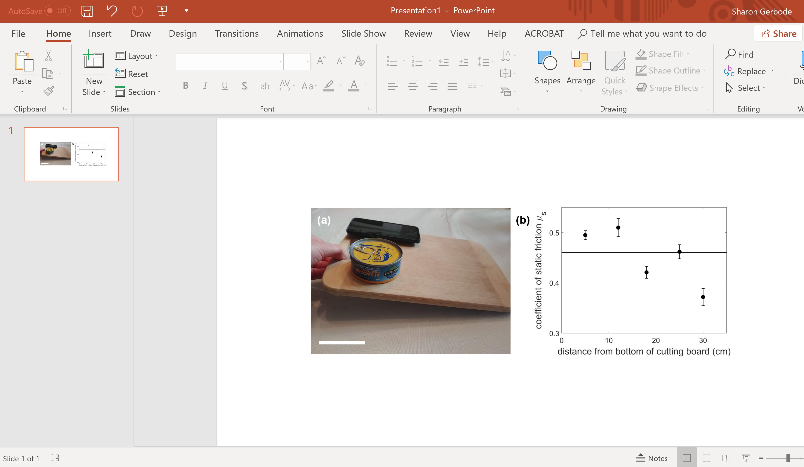

## Assembling the figure in Powerpoint
To create your two-panel figure for the Module 1 deliverable, we recommend using Powerpoint to assemble the parts. If you don't have Powerpoint installed, you can [get it free from HMC CIS here](https://www.hmc.edu/cis/services/office-365-education-for-students/).

Open a new Powerpoint presentation and insert both the images you have made (the plot you've created and a photo of your setup).

For a scale bar, you will need to measure the length of a reference object (e.g., in real life, the tuna can in the image below is 8.5 cm in diameter). Then you can Insert->Shapes->Line in Powerpoint and make a scale bar of an appropriate size.

Insert text boxes to label the panels (a) and (b).

Then insert a text box for the caption. Advice for preparing a caption was provided [here](week3#a-figure-showing-a-plot). You should use a single text box to create one caption that includes a title sentence followed by a description of each of the two panels. When you’re satisfied with how the figure looks, select all of the objects on the slide, right click to group the objects and then “Save As Picture”. You now have a saved figure file (save as a .png file for Gradescope submission please).
