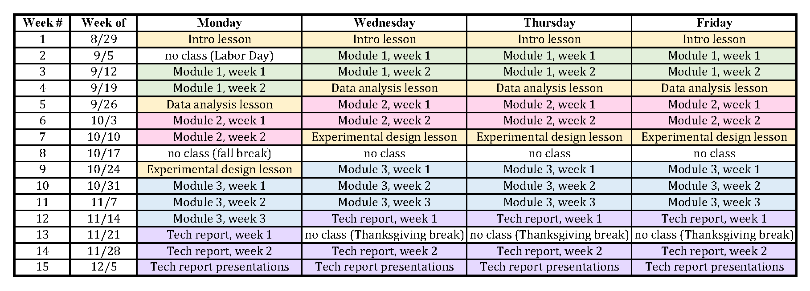

**Click on the image below to enlarge in a new tab:**
{:target="_blank"}

  
  

Instructors:  
S. Gerbode (gerbode@hmc.edu) 
T. Lynn (lynn@hmc.edu) 
R. Solanki (rsolanki@hmc.edu) 
D. Tamayo (dtamayo@hmc.edu) 

# Physics 50 Syllabus

+ [Preamble](#preamble)
+ [Course Structure and Due Dates](#course-structure-and-due-dates)
+ [Lab Books and Data Sheets](#lab-books-and-data-sheets)
+ [Collaboration](#collaboration)
+ [Grading](#grading)
+ [Absence from Class](#absence-from-class)
+ [Late Policy](#late-policy)
<!-- + [Online Resources](#online-resources) -->
<!-- + [Gradescope Submissions](#gradescope-submissions) -->
+ [Writing Center](#the-writing-center)
+ [Accomodations, Wellness, Belonging, Title IX](#accommodations)

# Preamble

By the end of this course you will be able to collect, analyze, and interpret real measured data in an ethical manner and draw meaningful conclusions from direct observations of the physical world. Toward that end, we hope that this course will provide you with specific skills but also with multiple opportunities to reflect on and refine your own experimental process and choices. Before each module you will learn relevant statistical techniques for analyzing data and quantifying uncertainty.  In each module you will first follow directions to become familiar with a new set of equipment and physical phenomena, and then use what you have learned to carry out careful measurements to determine a particular quantity or test a theory. In later modules you will set your own experimental goals. At the end of each module you will communicate the results of your experiment and analysis in a short written summary or oral presentation.

In order to be successful in this course you should:
+ be actively engaged and reach out for help when you get stuck 
+ complete mini-questions, checkpoints, and reports on time
+ document your work as you go along
+ design an experiment and carry it out, refine your methods along the way, go back and address major problems--do something, think about it, improve upon it
+ reflect on your results, identify main limitations and correct glaring omissions, identify any questions that your results raise
+ think about the questions that would arise in the next iteration of the experiment 
+ present your final results without major factual errors that undermine your credibility 
+ tell the story about why you did what you did and what conclusions you can draw

If we (your instructors) could do all of these all of the time we would be better physicists and probably better people in general. We are looking for you to demonstrate development and competence in these areas; we do not expect perfection.

# Course Structure and Due Dates
In this course you will complete four modules that each last several weeks.  Before each week of an experimental module, you will start by reading the online manual (linked on Sakai), where you will find background information and lab instructions, with miniquestions embedded throughout the text. These miniquestions are intended to help you quickly confirm your understanding of what you are reading and should be completed as you read. **Each week you are expected to read through the material for the week and complete the embedded mini-questions before the start of lab in order to be prepared to use your time efficiently in class.** After submission of a miniquestion, if your answer is incorrect you will be prompted to resubmit your answer. In order to receive credit for your resubmission, you must explain why your new answer is correct. When resubmitting, remember that your goal is not to describe what you did wrong but rather to explain and justify the correct answer.

During mid-module weeks, you will have a checkpoint due on Gradescope three days before the next lab meeting:

+ Monday sections: checkpoints due Fridays at 10 pm
+ Wednesday sections: checkpoints due Sundays at 10 pm
+ Thursday sections: checkpoints due Mondays at 10 pm
+ Friday sections: checkpoints due Tuesdays at 10 pm

After Modules 1-3 you will submit short written reports.  These reports should be no more than two pages, including figures, and should summarize your experimental procedure, results, and conclusions.  Each partner should prepare their own written report.  Your instructor will discuss the reports and their submission with you in more detail.  Written reports are due three days before the first meeting of the next module:

+ Monday sections: reports due Friday 9/30, 10/28, and 11/18 at 10 pm
+ Wednesday sections: reports due Sunday 9/25, 10/23, and 11/13 at 10 pm
+ Thursday sections: reports due Monday 9/26, 10/24, and 11/14 at 10 pm
+ Friday sections: reports due Tuesday 9/27, 10/25, and 11/15 at 10 pm

Rough drafts of the first two reports should be prepared for peer review during the "lesson" meetings following the end of these modules.  For the final module (the tech report), you and your partner will jointly give an oral presentation (see schedule) instead of submitting individual written reports.

# Lab Books and Data Sheets

In this course we will not be using traditional lab books. Instead you will be assigned a Google Doc and Google Spreadsheet at the beginning of each module to keep your lab record. These documents will be assigned through Google Classroom, which enables us to create copies of documents for every student and automatically share those documents with instructors.  You will meed to log in to Google Classroom when prompted from the Module instructions to access these documents, which will then be accessible in your Google Drive.  **The Google Docs and Sheets are not explicitly graded. Nevertheless, you are required to use them to document your work and data collected in the lab. The Google docs and Google spreadsheets issued to you through this course are accessible to your instructor, and should provide a clear and complete record of your in-lab and analysis work if your instructor seeks additional detail after reading a report.**

The Google Doc and Google Sheets notebooks are intended to be used in parallel. In broad terms we encourage you to use the Google docs notebook to keep detailed notes and images of your experimental set-up and the Google sheets for data collection and analysis, with sufficient organization and description that a student not enrolled in Physics 50 would be able to understand your data and analysis. We describe our expectations in more detail below.

## Google Doc Notebook:
What we will stress in this course is not a particular structure or format for your lab book, but rather the usefulness of the record. The hallmark of a good lab book is how useful it is to you and others at a later point in time.  Ask yourself these questions when faced with a blank lab notebook page:  What information will I need to replicate this experiment in 6 months or 6 years? Would a sketch or photo of the setup be helpful? How exactly did I take that particular data point? Was there something strange about it?  What did or did not work in my experimental procedure and what did I learn from it? What are my units? What does this variable mean? etc.

Some tips: 

+ Don’t rewrite history. 
    + If you realize you made a procedural mistake, resist the temptation to omit what was incorrect. Your lab notebook needs to be a complete record of what actually happened; that means the bad as well as the good.
    + Suggestions: use the comment feature, make a note in a different color (note the date if different), or highlight your mistake and refer yourself to further down the document where you’ve written up the correction. Find the method that works for you, but be sure your record is complete.
    + This applies to both your Google doc and Google sheets documents
+ Include handwritten work.
    + There is rarely a lab that does not require a sketch or calculation. Do not use “scratch paper” without including it in your lab record. 
    + Google Docs has an app that allows you to insert a photo directly into your document from your phone. You can also use a camera to take a photo of your notes and upload them to your computer.
+ Include photos of your apparatus.
    + A picture truly is worth a thousand words when you are trying to remember how to set up your apparatus, or how to take a particular measurement.
    + It can be particularly powerful to upload a photo and then annotate it with a few well-placed arrows, words, etc.
+ Link to your various electronic files (Google Sheets, etc) in the body of your document in the context of describing how you took that particular data. 
    + You can simply copy the URL of the item you wish to link to and paste it into your document.

## Data Sheets
We expect you to make use of formulae in Google Sheets to make your intermediate calculations. This helps avoid mistakes and makes it easier to fix any mistakes later. It is also how we understand and evaluate some of your work if questions arise when we read your reports.  You are required to use your spreadsheet not just to record data but also to do the analysis using formulas in Sheets (not your calculator). If entries are entered without making use of Google sheets to do the calculations you may not receive full credit for your work. Your data sheet, coupled with the history feature of Google Sheets, also serves as a time record of your work in the lab. Recording data elsewhere and then later pasting it into Google sheets is not acceptable. However, it is acceptable to collect data in one lab partner's sheet and then copy it to the other partner's sheet. If doing this, you should include a note to the effect "this data was originally collect in **Name of Lab Partner**'s laboratory notebook and is reproduced here". 

# Collaboration
You will collect data with a partner in the lab. We expect individual students to complete the miniquestions, data analysis, checkpoints, and reports for themselves. If you would like to discuss with your lab partner or another classmate while doing analysis in parallel, we encourage that type of collaboration! It may not save you much time, but often working through material together gives a better learning experience. **Just remember that each of you needs to do your own analysis. It is not acceptable to turn in your lab partner's writing or products of their analysis such as a plot they prepared.**

<!-- Module 1 will be completed in remote format. For this module you are welcome to work on your own or with one partner.  If you choose to work with a lab partner, your lab partner for this module must be currently enrolled in Physics 50 but does not need to be in your section. If you work with a lab partner please indicate who you worked with within your Google Sheets data sheet. -->

<!-- # Gradescope Submissions
**In order to provide timely feedback, and considering that different sections have work due on different days, we will frequently return work before all students have submitted their assignments. To make this possible with the constraint of using a shared Gradescope portal for all sections, we cannot accept resubmissions in this course. Please prepare your assignment in a separate document. When you are ready to submit your work, enter all entries into Gradescope in a single sitting without using the "save" button and then make use of the "submit" button to submit your work. You may not resubmit your work once it has been submitted (and saving in Gradescope is equivalent to submitting). Your instructor will go over this policy on the first day of class. If you have questions please ask.**

Some checkpoints are submitted in two parts for which part 1 is a practice calculation for which the above policy doesn't apply. When this occurs it will be clearly indicated. When a checkpoint is in two parts, the total points for the two parts will be combined to give the checkpoint grade. -->
 

# Grading
The course grade will be calculated based upon your performance on the mini-questions, checkpoints, reports, and in-lab conduct.

Final grades will be determined as follows:
+ Timely completion of the reading miniquestions: 20%
+ Checkpoints: 10%
+ Reports: 60%
+ Lab Citizenship: 10%

All modules must be satisfactorily completed (lab weeks attended or made up, and reports submitted) to pass this course. 

<!-- Grades on the checkpoints and deliverables will be renormalized before averaging so that within their respective category all 3 deliverables are equally weighted and similarly for checkpoints. -->

<!-- Please note that in this course, in order to provide quick feedback, most grades will be published and released on Gradescope as the work is being graded. However, we do at times need to go back and make adjustments to ensure consistency and therefore do not consider grades final until ~2 weeks after they are released. -->

# Absence from Class
Please do not attend class if you are ill or subject to quarantine due to possible COVID-19 exposure. However, attendance at all class meetings is required except in case of illness, school-related travel, or family or personal emergency.  Any missed lab days must be made up.  Please do reach out to your instructor as soon as you know (or expect) you will be unable to attend a class, and we will work with you to make alternate arrangements including no-penalty extensions. 

# Late Policy
You may have two extensions of up to 24 hours without penalty over the course of the semester, to be used for checkpoints or written reports (but not mini-questions or the tech report oral presentation).  To use one of these extensions, simply email your instructor by the regular deadline for the assignment.

When an extension has not been granted, late work will be accepted within the windows listed below with the following deductions. These deductions are based on the available points for the item, not your score:

## Miniquestions
Mini-questions are intended to help you prepare for your time in lab and are due at the start of lab. We therefore do not offer extensions on mini-questions.

## Checkpoints and Reports
+ Up to 5 hours past the deadline: 5%
+ Up to 24 hours past the deadline: 10%
+ Up to 48 hours past the deadline: 15%
+ Up to 72 hours past the deadline: 20%

 If you are experiencing extenuating circumstances please don't hesitate to reach out to your instructor to seek accommodation beyond the structures listed above. 

<!-- # Online Resources
The course website is available on Sakai, where you will find links to each module of the course in the side menu of the Physics 50 page. Also linked from that page are Gradescope and Piazza. You will submit the module checkpoints (and reports??) through Gradescope. To offer another way for students to communicate with each other we have created [this Piazza site](https://piazza.com/hmc/spring2022/ph50){:target="_blank"}. In Piazza you can ask questions to the class; we encourage you to use this forum to ask your classmates course-related questions and to answer each other's questions. There are no grades associated with participation on Piazza; it is for your own benefit as a means to collaborate with each other. Office hours are posted on the "Office Hours" link on the side menu of Sakai. Please note that you must be logged into your g.hmc.edu account through a Google Chrome browser to access this information. **Students should feel welcome to attend any professor’s office hours.**

We will also be using Google apps including Docs and Sheets. Several templates and blank documents will assigned throughout the course via Google Classroom, which enables us to create copies of documents for every student. You will need to log in to Google Classroom when prompted from the Module instructions, but you do not need to actively monitor Google Classroom for new assignments. Sakai is our primary point of contact with you, not Google Classroom. -->

# The Writing Center
The Writing Center provides a welcoming space for writers to get feedback on their composition projects, whether written, spoken or visual pieces. Writing Center Consultants are prepared to assist students in any discipline with any stage of the writing process, from developing an idea to polishing a final draft. Even the most accomplished writers benefit from seeking feedback at the Writing Center. You may schedule an appointment through their website, https://www.hmc.edu/learning-programs/writing-center/

# Accommodations
HMC is committed to providing an inclusive learning environment and support for all students. As we continue to navigate the effects of the pandemic, we recognize that the challenges facing students may be different and student accommodation needs may change. Students with a disability (including mental health, chronic or temporary medical conditions) who may need accommodations in order to fully participate in this class are encouraged to contact the Office of Accessible Education at access@g.hmc.edu to request accommodations. Students from the other Claremont Colleges should contact their home college's Accessible Education officer.

# Wellness 
College can be stressful, and it’s important to support the physical and mental well-being of ourselves and others even as we work to learn challenging new material in courses. That means getting some food, sleep, exercise and relaxation even during crunch time! If you find that you are in need of help or overwhelmed by this class, don’t hesitate to reach out to your instructor or the Academic Deans at academicdeans@g.hmc.edu. We will work with you to develop a plan for success in this course. 

# Belonging
Everyone who is registered for this course belongs here and has valuable contributions to make to our class. Our diversity of backgrounds, experiences, and viewpoints will enrich the classroom, and our mutual respect will allow us all the grace to make mistakes and learn from them.

# Title IX Notification
Harvey Mudd College is committed to providing an environment free of all forms of discrimination and sexual harassment, including sexual assault, domestic violence, dating violence, and stalking. If you (or someone you know) has experienced or experiences any of these incidents, know that you are not alone. We are available to talk to you if you are in need although we are obligated to report any contraventions of Title IX to the HMC Title IX Coordinator, Jennifer Alanis (jalanis@hmc.edu). If you want to speak to someone confidentially, the following resources are available on and off campus: the EmPOWER Center (909-607-2689), the Monsour Counseling Center (909-621-8202), the Project Sister Family Services' 24-hr sexual assault hotline (909-626-4357, ask for HMC Advocates) and the McAlister Chaplains (909-621-8685). Additional information about your options is also available at https://www.hmc.edu/tix. 

